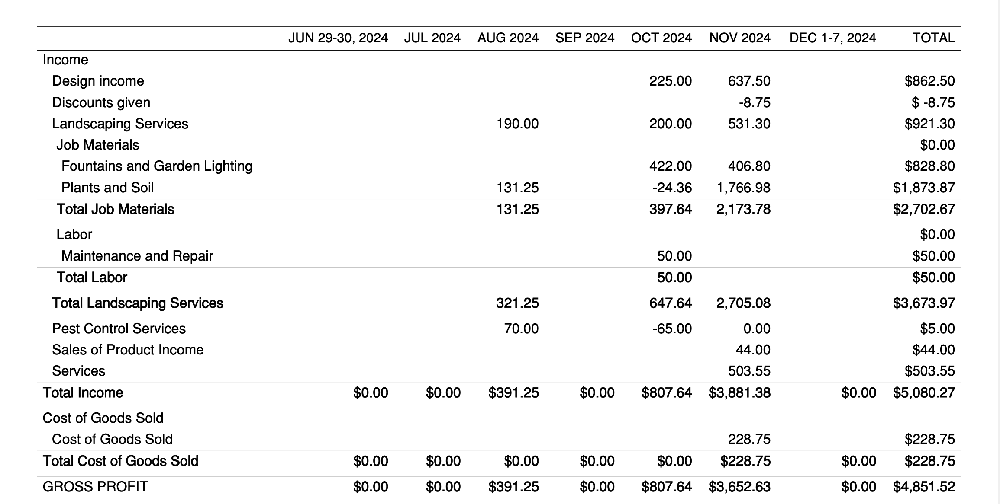

# Crediflow Interview

## Run python backend server

```
pip install -r requirements.py
python main.py
```

Verify the API's returning sample data http://localhost:8000/quickbooks/profit-and-loss

The returned data is a sample dump of quickbooks report (profit & loss), you can read about the schema in the [documentation](https://developer.intuit.com/app/developer/qbo/docs/api/accounting/all-entities/profitandloss). Check [profit&loss](./assets/Sandbox%20Us%201%20ProfitandLoss.pdf) for the complete representation of data.

The schema's a nested representation of data header rows. You can explore genson/datamodel-codegen or other tools to create models from the data/json file to simplify your workflow.

## Run react frontend client

```
cd client
npm install
npm run dev
```
Verify the Frontend running on http://localhost:5173/


## Assignment
- [ ] Build a simple frontend app in react to show the consumed report data in the following table format.
- [ ] Update the backend server as required to simplify rendering data for UI.
- [ ] If you have achieved displaying the table without any backend changes, update the server to return balance sheet information

    


### Sharing the Assignment
Create a fork of the repository and add [devdinu](https://github.com/devdinu/) as collaborator. If you're keeping the repository public, please make it private after 3 days of the interview.
